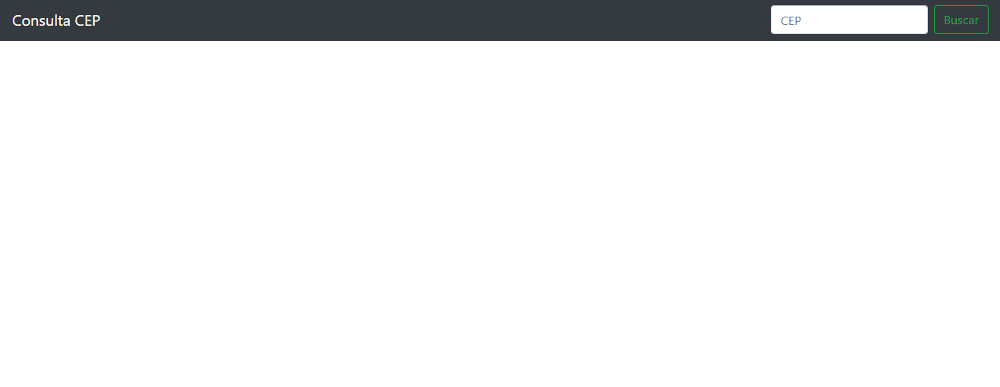

# aula-jquery-ajax
Introdução ao JQuery  e Ajax

Projeto construído na aula do tutor Rafael Galeani da Dio.me acerca da construção de um website que consulta CEPs, usando Jquery e Ajax.

[Clique aqui para acessar](https://leo211990.github.io/aula-jquery-ajax/)

## Tecnologias
 - HTML;
 - CSS;
 - JQuery;
 - Ajax;
 - Bootstrap.

 ##Contato

 leonnam.souza@gmail.com
